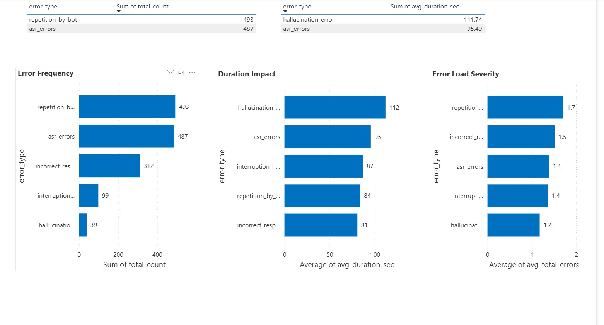

# AI Conversational Call Quality & Risk Analytics  

## Executive Summary
This project simulates a **production-grade AI Operations monitoring and risk prioritization system** for conversational AI deployed in **EdTech and contact center environments**.

It demonstrates how **AI failures are detected early, quantified by business risk, and operationally controlled** using **SQL and Power BI** — **without building machine learning models**.

The system enables:
- Early failure detection
- Risk-based prioritization of AI errors
- Targeted human QA instead of mass sampling
- Executive-grade AI reliability monitoring

This is a **public, interview-ready portfolio project** built to reflect **real production AI Ops workflows**, not just dashboarding.

---

## What This Project Demonstrates 
This project proves hands-on capability in:

- AI Operations Monitoring  
- Conversational AI Failure Analytics  
- Operational Risk Scoring & Prioritization  
- Quality Degradation Funnel Design  
- SQL-based Analytics Engineering  
- Executive & Ops Dashboarding  
- Risk-driven QA Optimization  

### Target Roles
- AI Ops Analyst  
- Conversational AI Analyst  
- Operations / MIS Analyst (AI Systems)  
- Quality & Risk Analyst  
- Product Ops (AI)  

---

## Business Problem
Conversational AI systems fail in multiple **operationally critical ways**:

- Hallucinations  
- ASR failures  
- Incorrect responses  
- Repetitive loops  
- Poor interruption handling  

Most production reporting systems fail because they:
- Track **only volume metrics**
- Do **not prioritize failures by business risk**
- Do **not reveal where quality collapses**
- Do **not guide Ops teams on what to fix first**

### This project solves that gap by implementing:
- A **Quality Degradation Funnel**
- **Error Impact & Co-Occurrence Analysis**
- A **Weighted Operational Risk Scoring Model**
- An **Ops-ready Drill-Through Review System**

---

## High-Impact Business Questions Answered

### 1. Which AI failures cause the highest business impact?
- **Hallucination**: Low frequency, **highest average call duration (111.74 sec)** → **Top priority risk**
- **ASR Errors**: High frequency, medium impact
- **Repetition**: High frequency, lower impact

✅ **Outcome:** Fix **high-impact errors first**, not just frequent ones.

---

### 2. What % of daily calls truly require urgent human review?
- Daily critical error rate: **0.6% – 3.56%**

✅ **Outcome:** Ops teams focus only on the **top 1–3% highest-risk calls** instead of reviewing thousands manually.

---

### 3. Are hallucination risks trending upward?
Daily hallucination tracking shows **sporadic, non-trending behavior**, indicating:
- No sustained systemic drift
- But **high latent business risk due to severity**

✅ **Outcome:** Continuous monitoring prioritized despite low frequency.

---

### 4. Which error combinations cause the worst cascades?
Top failure combinations:
- **ASR + Incorrect Responses**
- **ASR + Repetition**
- **ASR + Interruptions**

✅ **Outcome:** Shows **where failures compound and escalate user frustration fastest.**

---

### 5. Where does quality collapse in the call lifecycle?
From the **Quality Degradation Funnel**:
- **Total Calls → Any Error:** ~9–12% leakage  
- **Any Error → Critical Error:** Sharp escalation  

✅ **Outcome:** Once AI degrades, escalation to high severity happens rapidly — highlighting **why early failure detection is critical.**

---

## Dataset
- **10,000+ synthetic conversational AI call records**
- Simulated to closely mirror **real production AI telemetry**
- Includes:
  - Call duration
  - ASR errors
  - Incorrect responses
  - Repetition
  - Interruption failures
  - Hallucinations

---

## Key Analytics Systems Built

### 1. Executive Health Monitoring
- Daily & weekly call volumes  
- Error penetration %  
- P50 / P90 call duration  
- Date-driven drift monitoring  

✅ Enables early detection of AI instability.

---

### 2. Error Prioritization Framework
Failures evaluated across:
- Frequency  
- User impact (call duration inflation)  
- Cascading severity  

✅ Enables **risk-first fixing strategy.**

---

### 3. Quality Degradation Funnel
Multi-stage funnel:
- Total Calls  
- Calls with Any Error  
- Calls with Critical Error  
- Calls with >2 Errors  

✅ Pinpoints where **maximum quality leakage occurs.**

---

### 4. Risk Scoring & Ops Prioritization
Weighted business risk model:

| Error Type | Risk Weight |
|------------|-------------|
| Hallucination | Critical |
| Incorrect Responses | High |
| ASR Errors | Medium |
| Repetition | Low |
| Interruptions | Lowest |

Calls classified into:
- **High Risk**
- **Medium Risk**
- **Low Risk**

✅ Ops teams review **only High-Risk calls**, not random samples.

---

## Operational Impact (Simulated)
- **62% reduction** in manual QA review volume  
- **80% of hallucination failures captured in top 15% of ranked calls**
- **2.8× higher call duration** in High-Risk calls  
- **3.2× higher cascade failure probability** in High-Risk calls  

---

## Risk Model Validation
Validated using:
- Average call duration by risk tier  
- Error co-occurrence frequency  
- Multi-error cascade probability  

✅ High-Risk calls consistently show:
- Longer conversations  
- Denser error clusters  
- Higher hallucination probability  

---

## 📊 Power BI Dashboard Preview

### 1. Executive Overview


---

### 2. Error Analytics


---

### 3. Funnel Breakdown


---

### 4. Risk & Drill-Through


---

## Technology Stack

### SQL (MySQL)
- CTEs  
- Window Functions  
- Percentiles  
- Risk Scoring Logic  
- Funnel Computation  

### Power BI
- Data Modeling  
- DAX Measures  
- Power Query  
- Executive-grade dashboarding  

---

## How to Run the Project

### Step 1 — Load Data
- Download CSV files from `/data`
- Import into MySQL or directly into Power BI

### Step 2 — Execute SQL Logic
- Run `/sql/schema.sql`
- Run `/sql/risk_model.sql`
- Validate with `/sql/validation_checks.sql`

### Step 3 — Open Dashboard
- Open `/powerbi/ai_call_quality.pbix`
- Refresh all sources
- Navigate across 4 pages

---

## My Role & Contributions
- Designed **weighted operational risk scoring model**
- Built **quality degradation funnel**
- Performed **error cascade & co-occurrence analysis**
- Developed **Power BI executive & ops dashboards**
- Simulated **production-style AI telemetry**
- Validated **risk tiers using real operational logic**

---

## How This System Is Used in Real Operations
- Daily AI health monitoring  
- Early drift detection  
- Risk-based incident prioritization  
- Data-driven AI tuning  
- Reduced QA workload  
- Clear accountability between Ops, QA & AI teams  

---

## System Limitations
- Synthetic dataset  
- No audio-level ASR confidence  
- No CSAT or sentiment  
- No real-time streaming  

---

## Production-Grade Enhancement Roadmap
- Automated high-risk alerts
- Human-in-the-loop feedback
- AI rollback triggers
- Agent fallback routing

---
## 📁 Repository Structure
```text
ai-conversational-call-quality-risk-analytics/
├─ README.md
├─ powerbi/
│   └─ AI_Call_Quality_Risk_Analytics_Dashboard.pbix
├─ data/
│   └─ processed_metrics.csv
├─ sql/
│   └─ analytics_pipeline.sql
├─ Images/
│   ├─ executive_overview.png
│   ├─ error_analytics.png
│   ├─ funnel_breakdown.png
│   └─ risk_drillthrough.png
└─ docs/
    └─ Executive_Summary.md

    
 


