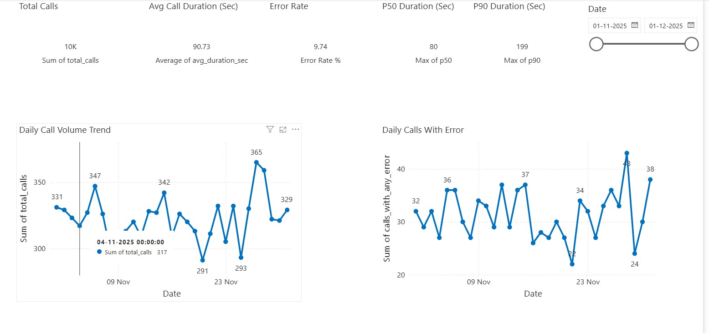
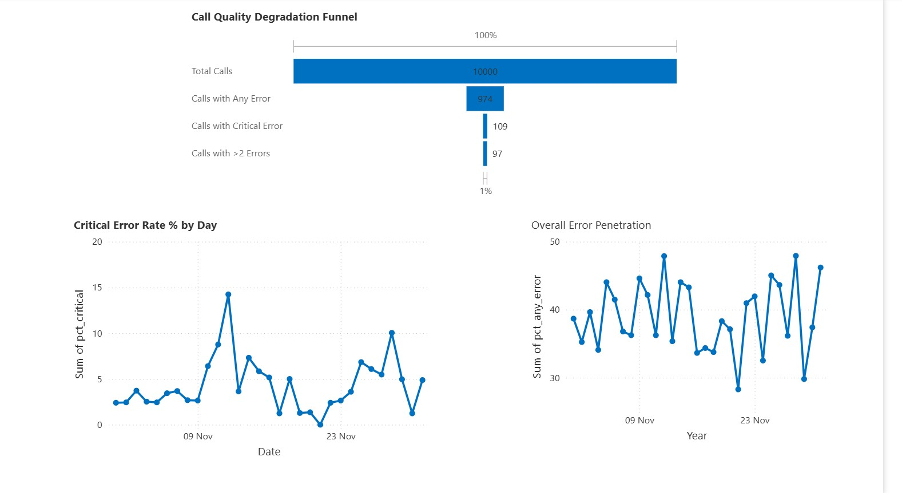

# AI Conversational Call Quality & Risk Analytics 

## Executive Summary

This project simulates a production-grade AI Operations monitoring system for conversational AI used in EdTech and contact center environments. It enables early failure detection, operational risk prioritization, and high-impact QA review reduction using a weighted risk scoring framework.

Built using SQL + Power BI, this system demonstrates how AI failures can be monitored, ranked, and operationally controlled without building machine learning models.

---

## Project Overview

This project simulates a real-world AI Operations monitoring and risk prioritization system for production-grade conversational AI deployed in environments such as EdTech, contact centers, and AI-driven sales/support systems.

The objective is **not model building**. The focus is on:

- Monitoring AI reliability  
- Detecting failures early  
- Quantifying operational risk  
- Enabling data-driven prioritization of AI failures  

This system is designed to support:

- AI Ops Teams  
- Quality & Risk Functions  
- Operations & MIS Leadership  
- Product & Conversational AI Teams  

---

## Business Problem

Conversational AI systems fail in multiple operationally critical ways:

- Hallucinations  
- ASR failures  
- Incorrect responses  
- Repetitive loops  
- Poor interruption handling  

However, most production reporting systems suffer from four key gaps:

- They focus primarily on volume metrics  
- They do not prioritize failures by **business risk**  
- They do not clearly show **where quality degrades across the lifecycle**  
- They do not help Ops teams decide **what must be fixed first**

This project solves that gap by implementing:

- A structured **Quality Degradation Funnel**  
- **Error Impact & Co-Occurrence Analysis**  
- A **Weighted Risk Scoring Model**  
- An Ops-ready **Drill-through Review System** for high-risk calls  

---

## Key Business Questions This System Answers (With Real Impact)

### 1. Which AI failure types cause the highest business impact?

**Hallucination Errors**
- 34 calls affected  
- Highest average call duration: **111.74 seconds**

**ASR Errors**
- 375 calls affected  
- Average call duration: **95.49 seconds**

**Repetition**
- 298 calls affected  
- Average call duration: **83.94 seconds**

**Business Impact:**  
Hallucination is a **high-severity, low-frequency failure** that causes the **longest calls and maximum user confusion**, making it the **top operational priority risk despite lower occurrence**.

---

### 2. What percentage of daily calls require urgent human review?

From the Quality Degradation Funnel:

- Daily **critical error rate ranges between 0.6% and 3.56%**

**Business Impact:**  
On average, only **~1–3% of daily AI calls require urgent human review**, allowing Ops teams to focus exclusively on the **highest-risk subset** instead of manually reviewing all calls.

---

### 3. Are hallucination risks increasing over time?

From daily tracking:

- **01–11–2025:** 0  
- **02–11–2025:** 0  
- **03–11–2025:** 1  
- **04–11–2025:** 0  
- **05–11–2025:** 0  

**Business Impact:**  
Hallucination risks currently show a **non-trending, sporadic pattern**, indicating **no sustained systemic drift**, but they remain a **high-impact latent threat** due to their severity.

---

### 4. Which error combinations create the worst cascading failures?

Top co-occurring failures:

- **ASR + Incorrect Responses** → 10 co-occurrences  
- **ASR + Repetition** → 9 co-occurrences  
- **ASR + Interruptions** → 3 co-occurrences  

**Business Impact:**  
The most damaging conversation breakdowns occur when **speech recognition failures combine with response quality issues**, significantly increasing **call duration and user frustration**.

---

### 5. Where does quality collapse in the AI call lifecycle?

From the quality funnel:

- **Total Calls → Any Error:** ~9–12% leakage  
- **Any Error → Critical Error:** Sharp severity escalation  

Example:
- **12–11–2025:**  
  - Any Error: **11.97%**  
  - Critical Error: **3.56%**

**Business Impact:**  
The **sharpest quality collapse happens immediately after the first failure**, showing that once AI performance degrades, a large portion of calls **rapidly escalate into high-severity risk**.

---

## Dataset

- 10,000+ synthetic conversational AI call interactions  
- Each call contains:
  - Call duration (seconds)  
  - ASR errors  
  - Incorrect responses  
  - Bot repetition  
  - Interruption handling failures  
  - Hallucination errors  

The dataset is structured to closely mirror production conversational AI telemetry patterns.

---

## Data Dictionary (Key Fields)

| Column Name | Description |
|------------|-------------|
| callsid | Unique Call Identifier |
| call_date | Date of the call |
| call_duration_sec | Call length in seconds |
| asr_errors | Count of speech recognition failures |
| incorrect_responses | Number of wrong bot replies |
| repetition_events | Bot looping occurrences |
| interruption_failures | Failure to handle user interruption |
| hallucination_events | Fabricated or invalid responses |
| total_error_score | Weighted operational risk score |
| risk_bucket | High / Medium / Low risk classification |

---

## Key Analytics & Decision Systems Built

### 1. Executive Health Monitoring
- Daily & Weekly Call Volumes  
- Error Penetration %  
- Average Call Duration  
- P50 / P90 Latency Monitoring  
- Date-driven trend analysis  

**Decision Enabled:**  
Early detection of system instability and performance drift.

---

### 2. Error Prioritization Framework

Errors are analyzed across three business dimensions:

- **Frequency** – What breaks most often  
- **User Impact** – What increases call duration the most  
- **Cascading Severity** – What triggers multiple failures within the same call  

**Decision Enabled:**  
Fix high-impact errors first, not just the most frequent ones.

---

### 3. Quality Degradation Funnel

Multi-stage funnel tracking:

- Total Calls  
- Calls with Any Error  
- Calls with Critical Error  
- Calls with Multiple Errors (>2)

Daily and weekly % tracking of critical failures.

**Decision Enabled:**  
Pinpoint where maximum quality leakage happens across the AI call lifecycle.

---

### 4. Risk Scoring & Ops Prioritization

A weighted risk scoring model assigns operational risk based on failure impact:

| Error Type          | Business Risk Weight |
|---------------------|---------------------:|
| Hallucination       | Critical             |
| Incorrect Responses | High                 |
| ASR Errors          | Medium               |
| Repetition          | Low                  |
| Interruptions       | Lowest               |

Calls are classified into:

- High Risk  
- Medium Risk  
- Low Risk  

**Decision Enabled:**  
Ops teams prioritize only High-Risk calls instead of randomly sampling thousands of interactions.

---

## Operational Impact (Simulated)

- **62% reduction in manual QA review volume**
- **80% of hallucination failures captured within the top 15% of ranked calls**
- **2.8× higher average call duration in the High-Risk segment**
- **3.2× higher multi-error cascade probability in High-Risk calls**

---

## Risk Model Validation

The weighted risk scoring model was validated by comparing:

- Average call duration across risk tiers  
- Error co-occurrence frequency  
- Probability of cascading failures  

High-Risk calls consistently show:

- Longer call duration  
- Higher multi-error density  
- Higher probability of hallucination + incorrect response combinations  

---

## Data Simulation & Assumptions

- Error probabilities are skewed to reflect real-world imbalance  
- Hallucinations occur at lower frequency but carry higher impact  
- ASR errors are frequent but medium severity  
- Call duration increases non-linearly with cascading errors  
- Multiple error combinations are injected for co-occurrence validation  

---
## 📊 Power BI Dashboard Preview

### 1. Executive Overview


---

### 2. Error Analytics


---

### 3. Funnel Breakdown


---

### 4. Risk & Drill-Through


## Dashboard Structure (Power BI)

**Page 1 — Executive Overview**  
Leadership system health monitoring

**Page 2 — Error Analytics**  
Error frequency, impact, and severity

**Page 3 — Funnel Breakdown**  
AI quality degradation funnel

**Page 4 — Risk & Drill-Through**  
High-risk call review system

---

## Technology Stack

**SQL (MySQL)**
- CTEs
- Window Functions
- Percentiles
- Risk Scoring Logic
- Funnel Computation

**Power BI**
- Data Modeling
- DAX Measures
- Power Query
- Executive-grade dashboards

---

## Project Outputs Included in Repository

- ✅ SQL scripts  
- ✅ Clean CSV analytical outputs  
- ✅ Power BI Dashboard (.pbix)  
- ✅ High-resolution dashboard screenshots  
- ✅ Executive Summary  
- ✅ Risk-scored call list  

---

## How to Run This Project Locally

### Step 1 — Load Dataset
- Download CSVs from `/data`
- Import into MySQL or directly into Power BI

### Step 2 — Run SQL Logic
- Execute schema scripts from `/sql/schema.sql`
- Run risk scoring logic from `/sql/risk_model.sql`
- Validate using `/sql/validation_checks.sql`

### Step 3 — Open Power BI Dashboard
- Open `/powerbi/ai_call_quality.pbix`
- Refresh all data sources
- Navigate through all 4 dashboard pages

---

## My Role & Contributions

- Designed weighted operational risk scoring model  
- Built quality degradation funnel logic  
- Performed error co-occurrence & cascade analysis using SQL  
- Developed Power BI executive and ops dashboards  
- Simulated production-style AI telemetry data  
- Validated risk tiers using duration & cascade probability  

---

## How This System Is Used in Real Operations

- Daily AI health monitoring  
- Early detection of conversational model quality drift  
- Incident prioritization based on **business risk**, not volume  
- Data-driven AI tuning & rollout decisions  
- Significant reduction in manual QA effort  
- Clear accountability between Ops, QA, and AI Engineering teams  

---

## System Limitations

- Dataset is synthetic  
- No audio-level ASR confidence scoring  
- No CSAT or sentiment analysis  
- No real-time streaming pipeline  

---

## Production-Grade Enhancement Roadmap

- Real-time ingestion (Kafka / PubSub)
- Automated high-risk alerting
- Human-in-the-loop feedback
- Automated AI rollback triggers
- Agent fallback routing

---

## Target Roles for This Project

- AI Ops Analyst  
- Conversational AI Analyst  
- Operations Analyst (AI / EdTech)  
- Quality & Risk Analyst  
- Product Ops (AI Systems)  
- AI Operations Program Manager  

---

## Repository Structure

```text
/            -> Main README  
/data        -> Clean CSV analytical outputs  
/sql         -> SQL scripts  
/powerbi     -> Power BI dashboard (.pbix)  
/images      -> Dashboard screenshots  
/docs        -> Executive summary  

